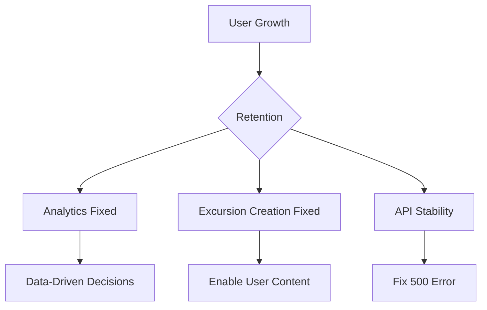

# Hundkrets Weekly Review — 2026-05-05

## Metrics Snapshot
| Metric | Value | Δ (7d) |
|--------|-------|--------|
| Total Users | 110 | |
| New Users | 1 | |
| Connection Requests | 48 | -2 |
| New Connections (7d) | N/A (no created field) | |
| Excursions Created | 1 | -2 |
| New Excursions (7d) | N/A (no created field) | |
| Page Views (7d) | 0 | |
| Unique Visitors (7d) | 0 | |
| Emails w/ Errors | 0 | |

Top Pages (7d):
None (Umami metrics are zero)

## Website Audit Findings
- **Registration & Onboarding**: Flow is functional. The audit successfully registered `anna.malmo@example.com` and proceeded to the onboarding choice and profile filling steps.
- **Explore & Excursions**: The `excursionFlow` reported `hasCreateBtn: false`, and the `excursionsPublic` view also lacked a create button. This suggests users might be unable to create excursions via the UI.
- **Account Deletion**: The `deleteBtnFound` was false in both `/app/profile` and `/app/settings`, requiring a fallback to the PB SDK.
- **Landing Page**: CTA and Map are visible.

## System Health
- **Critical API Error**: The admin logs show a `GET /api/hundkrets/dog-gallery` returning a **500 Internal Server Error**.
- **Analytics**: Umami metrics are all zero. The report explicitly warns: "tracking script may not be installed on hundkrets.se".
- **Email Delivery**: No errors in the email log; multiple verification emails were sent successfully to the test account.

## Priorities
### 🔴 Critical — fix this week
- **Fix Dog Gallery API**: Resolve the HTTP 500 error on `/api/hundkrets/dog-gallery`.
- **Restore Analytics**: Verify and reinstall the Umami tracking script on `hundkrets.se`.

### 🟡 Important — within 2 weeks
- **Excursion Creation**: Investigate why the "Create Excursion" button is missing from the UI.
- **Account Deletion UI**: Add a visible "Delete Account" button in the user settings to avoid reliance on backend scripts.

### 🟢 Nice to have — backlog
- **Onboarding UX**: Review the transition from profile filling to the explore page to ensure a seamless "first-run" experience.

