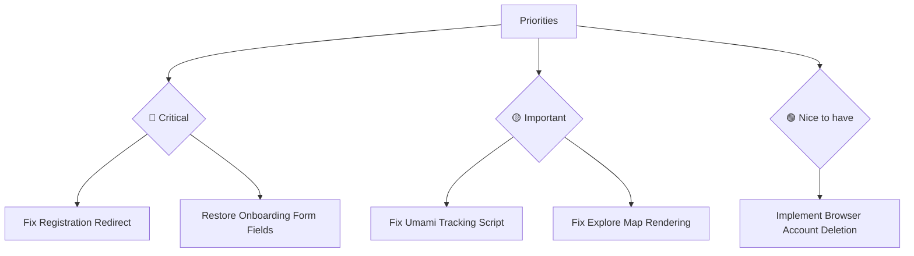

# Hundkrets Weekly Review — 2026-05-11

## Metrics Snapshot
| Metric | Value | Δ (7d) |
|--------|-------|--------|
| Total Users | N/A | |
| New Users | N/A | |
| Connection Requests | N/A | |
| New Connections (7d) | N/A | |
| Excursions Created | N/A | |
| New Excursions (7d) | N/A | |
| Page Views (7d) | 0 | |
| Unique Visitors (7d) | 0 | |
| Emails w/ Errors | N/A | |

Top Pages (7d):
None.

## Website Audit Findings
- **Registration Broken**: Registration did not redirect to onboarding/app. The user remained at `https://hundkrets.se/register`. This is a critical flow failure.
- **Onboarding Issues**: The inline profile form is missing essential fields (`hasNameField: false`, `hasPostalField: false`) and the map is not rendering (`hasMap: false`).
- **Explore/Excursions**: Logged-in explore page showed no map (`hasMap: false`). Public excursions page redirected to login, and no guest navigation or "Create" buttons were found.
- **Account Deletion**: The delete button was not found in `/app/profile` or `/app/settings`.

## System Health
- **Analytics**: All Umami metrics are zero. The tracking script may not be installed or is not functioning on `hundkrets.se`.
- **Admin Access**: Admin check was skipped due to missing credentials or authentication failure.

## Priorities

### 🔴 Critical — fix this week
- **Fix Registration Flow**: Resolve why `/register` does not redirect to onboarding; currently blocks all new user acquisition.
- **Restore Onboarding Form**: Fix missing Name and Postal code fields and ensure the map renders during onboarding.

### 🟡 Important — within 2 weeks
- **Analytics Setup**: Verify and fix Umami tracking script installation to regain visibility into user behavior.
- **Map Integration**: Investigate why the map is missing on the Explore page.

### 🟢 Nice to have — backlog
- **UI/UX**: Add "Create Excursion" and guest navigation to public pages to improve discovery.
- **Account Management**: Add a visible "Delete Account" button in user settings.
