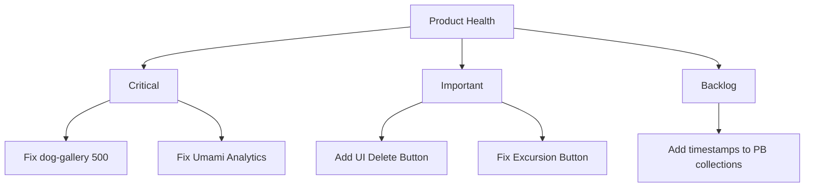

# Hundkrets Weekly Review — 2026-05-18

## Metrics Snapshot
| Metric | Value | Δ (7d) |
|--------|-------|--------|
| Total Users | 110 | |
| New Users | 0 | |
| Connection Requests | 48 | -2 |
| New Connections (7d) | N/A (no created field) | |
| Excursions Created | 1 | -2 |
| New Excursions (7d) | N/A (no created field) | |
| Page Views (7d) | 0 | |
| Unique Visitors (7d) | 0 | |
| Emails w/ Errors | 0 | |

Top Pages (7d):
None (Umami returning zeros)

## Website Audit Findings
- **Umami Tracking**: The Umami dashboard and metrics are all zero. The tracking script may not be correctly installed or configured on `hundkrets.se`.
- **Onboarding & Registration**: The self-registration flow is working (success: true) and redirects correctly to `/onboarding/choice`.
- **Account Deletion**: The browser-based account deletion button was not found in `/app/profile` or `/app/settings`, triggering the PB SDK fallback.
- **Excursion Flow**: No "Create" button found in the excursion flow (`hasCreateBtn: false`), which may be a regression or a permission issue.

## System Health
- **Critical Error**: The admin logs show a `GET /api/hundkrets/dog-gallery` request returned a **500 Internal Server Error**.
- **Email Delivery**: Email logs show verification emails and login notifications are being sent successfully.
- **Auth**: Admin and user authentication processes appear healthy.

## Priorities

### 🔴 Critical — fix this week
- **Fix `dog-gallery` endpoint**: Resolve the 500 error in the API to restore gallery functionality.
- **Restore Umami Tracking**: Verify and fix the analytics script installation to regain visibility into user traffic.

### 🟡 Important — within 2 weeks
- **Implement Account Deletion Button**: Add a visible "Delete Account" button in the user settings UI to avoid reliance on SDK fallbacks.
- **Investigate Excursion Creation**: Fix the missing "Create Excursion" button to allow users to organize meetups.

### 🟢 Nice to have — backlog
- **Add `created` field to collections**: Add timestamps to `connection_requests` and `excursions` to enable weekly delta tracking in reviews.

