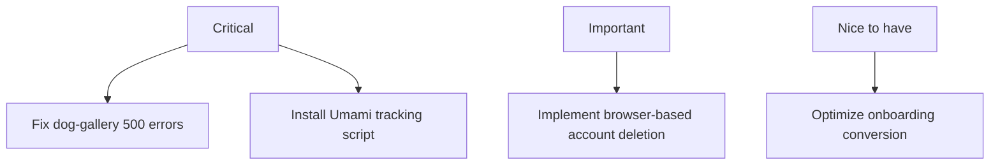

# Hundkrets Weekly Review — 2026-05-25

## Metrics Snapshot
| Metric | Value | Δ (7d) |
|--------|-------|--------|
| Total Users | 110 | |
| New Users | 0 | |
| Connection Requests | 48 | -2 |
| New Connections (7d) | N/A (no created field) | |
| Excursions Created | 1 | -2 |
| New Excursions (7d) | N/A (no created field) | |
| Page Views (7d) | 0 | |
| Unique Visitors (7d) | 0 | |
| Emails w/ Errors | 0 | |

Top Pages (7d):
(None reported)

## Website Audit Findings
- **Tracking Issues**: Umami metrics are all zero, suggesting the tracking script may not be installed on `hundkrets.se`.
- **Navigation/Flow**: Registration succeeded, and the user was redirected to `/onboarding/choice`.
- **Account Management**: The browser-based "Delete Account" button was not found in `/app/profile` or `/app/settings`, requiring a fallback to the PocketBase SDK for deletion.
- **Visuals**: All core onboarding and explore pages are rendering (based on reported success in registration and onboarding flow).

## System Health
- **API Errors**: Admin logs show multiple `HTTP 500` errors for the `/api/hundkrets/dog-gallery` endpoint.
- **Auth/Security**: Several "Login from a new location" emails were sent to the admin account, which may be expected during testing but should be monitored.
- **Email Flow**: Verification emails are being successfully sent (e.g., to `anna.malmo@example.com`).

## Priorities

### 🔴 Critical — fix this week
- **Fix `dog-gallery` endpoint**: Resolve the HTTP 500 errors appearing in the admin logs to restore gallery functionality.
- **Fix Analytics**: Verify and install the Umami tracking script on the production site to stop reporting zero metrics.

### 🟡 Important — within 2 weeks
- **Account Deletion UI**: Add a visible "Delete Account" button to the user profile or settings page to avoid relying on SDK fallbacks.

### 🟢 Nice to have — backlog
- **User Growth**: Investigate why new user growth is currently stagnant (0 new users this week).
