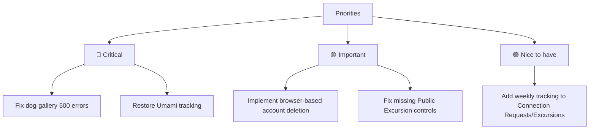

# Hundkrets Weekly Review — 2026-06-01

## Metrics Snapshot
| Metric | Value | Δ (7d) |
|--------|-------|--------|
| Total Users | 110 | |
| New Users | 0 | |
| Connection Requests | 48 | -2 |
| New Connections (7d) | N/A (no created field) | |
| Excursions Created | 1 | -2 |
| New Excursions (7d) | N/A (no created field) | |
| Page Views (7d) | 0 | |
| Unique Visitors (7d) | 0 | |
| Emails w/ Errors | 0 | |

Top Pages (7d):
(No data available - all metrics zero)

## Website Audit Findings
- **Landing Page**: CTA and Map are visible.
- **Onboarding**: Registration successful. Profile form includes name, postal code, and map.
- **Explore**: Map rendering is functional for logged-in users.
- **Excursions**: Public guest navigation and "Create" button are missing/not found.
- **Account Management**: The delete button was not found in `/app/profile` or `/app/settings`, necessitating a SDK fallback for account deletion.

## System Health
- **Umami Analytics**: 🔴 All metrics are zero. Tracking script is likely not installed or misconfigured on `hundkrets.se`.
- **Admin Logs**: 🔴 Multiple `GET /api/hundkrets/dog-gallery` requests returned `500 Internal Server Error`.
- **Security**: Observations of `GET /.env` attempts (404) in logs indicate external bot scanning.
- **Emails**: Verification emails are being sent successfully (e.g., to `anna.malmo@example.com`).

## Priorities

### 🔴 Critical — fix this week
- **Fix `dog-gallery` endpoint**: Resolve the recurring 500 errors in the API to ensure the gallery loads.
- **Restore Umami Analytics**: Verify tracking script installation on `hundkrets.se` to regain visibility into user growth.

### 🟡 Important — within 2 weeks
- **Improve Account Deletion**: Add a visible "Delete Account" button to the user settings UI to avoid relying on backend scripts.
- **Fix Public Excursion Flow**: Investigate why the "Create" button and guest navigation are not visible on public pages.

### 🟢 Nice to have — backlog
- **Database Schema Update**: Add `created` timestamps to `connection_requests` and `excursions` collections to enable accurate weekly delta reporting.
