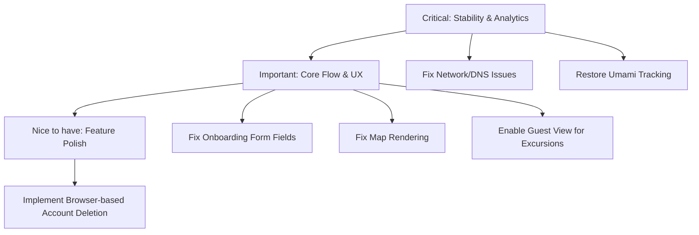

# Hundkrets Weekly Review — 2026-06-08

## Metrics Snapshot
| Metric | Value | Δ (7d) |
|--------|-------|--------|
| Total Users | N/A | |
| New Users | N/A | |
| Connection Requests | N/A | |
| New Connections (7d) | N/A | |
| Excursions Created | N/A | |
| New Excursions (7d) | N/A | |
| Page Views (7d) | 0 | |
| Unique Visitors (7d) | 0 | |
| Emails w/ Errors | N/A | |

Top Pages (7d):
(None reported)

## Website Audit Findings
The site is currently experiencing significant availability and network issues:
- **Landing Page**: Failed to load (`net::ERR_NETWORK_CHANGED`).
- **Registration**: Navigation interrupted by `chrome-error://chromewebdata/`.
- **Onboarding**: The profile form is missing critical fields (Name, Postal Code) and the map is not rendering.
- **Explore Page**: Logged-in explore page is accessible but the map is missing.
- **Public Pages**: Redirects to `/login`, preventing guest access to excursions.
- **Account Deletion**: Delete button not found in expected locations (`/app/profile`, `/app/settings`).

## System Health
- **Analytics**: Umami reporting all zeros. The tracking script may not be installed or is failing to load.
- **Umami Dashboard**: Timeout exceeded when attempting to access the dashboard.
- **Admin Access**: Skipped due to missing credentials or authentication failure.
- **Connectivity**: Frequent network errors during the audit indicate instability in the deployment or environment.

## Priorities

### 🔴 Critical — fix this week
- **Resolve Site Availability**: Fix the `ERR_NETWORK_CHANGED` and navigation interruptions preventing landing page and registration access.
- **Fix Analytics**: Verify and reinstall the Umami tracking script to resume data collection.

### 🟡 Important — within 2 weeks
- **Fix Onboarding Flow**: Restore missing Name and Postal Code fields and ensure the map renders for user profiles.
- **Restore Guest Access**: Ensure public excursions pages are accessible without requiring a login.
- **Fix Map Rendering**: Debug why the map is missing on both onboarding and explore pages.

### 🟢 Nice to have — backlog
- **Account Management**: Implement a visible "Delete Account" button in the user settings/profile UI.
