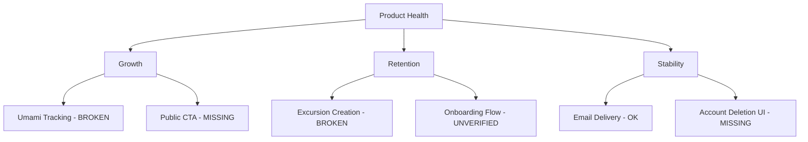

# Hundkrets Weekly Review — 2026-06-15

## Metrics Snapshot
| Metric | Value | Δ (7d) |
|--------|-------|--------|
| Total Users | 110 | |
| New Users | 0 | |
| Connection Requests | 49 | -2 (sentinel) |
| New Connections (7d) | N/A (no created field) | |
| Excursions Created | 1 | -2 (sentinel) |
| New Excursions (7d) | N/A (no created field) | |
| Page Views (7d) | 0 | |
| Unique Visitors (7d) | 0 | |
| Emails w/ Errors | 0 | |

Top Pages (7d):
(Empty - All Umami metrics are zero)

## Website Audit Findings
- **Tracking Failure**: Umami is reporting zero views and visitors. The report explicitly warns that the tracking script may not be installed on `hundkrets.se`.
- **Excursion Flow**: The audit found no "Create" button in the excursion flow (`hasCreateBtn: false`), meaning users cannot currently create excursions via the UI.
- **Public Access**: Guest navigation and "Create" buttons are missing from public excursion pages.
- **Account Deletion**: The browser-based delete button was not found in `/app/profile` or `/app/settings`, requiring a fallback to the PB SDK.
- **Onboarding**: The registration and onboarding flow appears functional (successfully registered `anna.malmo@example.com`), but the "Explore" and "Excursions" pages are redirecting back to `/onboarding/choice`, indicating a potential gap in the transition from onboarding to the main app.

## System Health
- **Email Delivery**: Email logs show successful delivery of verification emails and match notifications. No errors reported in the log sample.
- **Admin Health**: PocketBase admin logs and dashboard are accessible. Email log row count is 42.

## Priorities

### 🔴 Critical — fix this week
- **Fix Analytics**: Install or repair the Umami tracking script. We are currently flying blind with zero visibility into user behavior.
- **Restore Excursion Creation**: Fix the missing "Create" button in the excursion flow. The core value proposition of the app (creating meetups) is currently broken in the UI.

### 🟡 Important — within 2 weeks
- **Fix Account Deletion UI**: Implement a visible "Delete Account" button in settings to avoid relying on backend SDK fallbacks for user account management.
- **Verify Onboarding Completion**: Audit the transition from `/onboarding/choice` to the a fully "onboarded" state to ensure users aren't stuck in a redirect loop.

### 🟢 Nice to have — backlog
- **Public Page Enhancement**: Add guest navigation and "Join/Create" CTAs to public excursion pages to improve conversion from guest to user.

