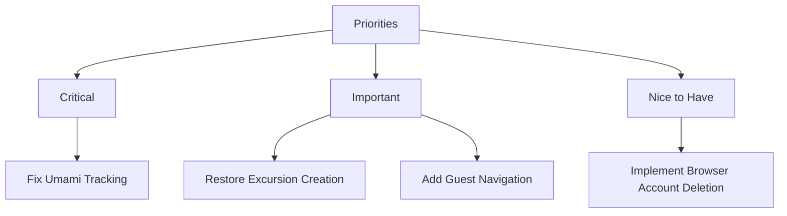

# Hundkrets Weekly Review — 2026-06-22

## Metrics Snapshot
| Metric | Value | Δ (7d) |
|--------|-------|--------|
| Total Users | 111 | |
| New Users | 1 | |
| Connection Requests | 49 | -2 (Sentinel) |
| New Connections (7d) | N/A (no created field) | |
| Excursions Created | 1 | -2 (Sentinel) |
| New Excursions (7d) | N/A (no created field) | |
| Page Views (7d) | 0 | |
| Unique Visitors (7d) | 0 | |
| Emails w/ Errors | 0 | |

Top Pages (7d):
None (All Umami metrics are zero)

## Website Audit Findings
- **Landing Page**: CTA and map are visible, but the site is completely devoid of traffic according to analytics.
- **Onboarding**: Registration and profile filling flow is functional. User is correctly redirected to `/onboarding/choice`.
- **Explore Page**: Map renders and is accessible after onboarding.
- **Excursion Flow**: `hasCreateBtn` is `false` in the report, suggesting a regression or missing permission/feature in the excursion creation flow.
- **Public Pages**: Guest navigation is missing (`hasGuestNav: false`).
- **Account Deletion**: Delete button not found in `/app/profile` or `/app/settings`, relying on SDK fallback.

## System Health
- **Umami Analytics**: 🔴 **CRITICAL**. All metrics are zero. The tracking script is likely not installed or misconfigured on `hundkrets.se`.
- **Email Delivery**: Healthy. Recent emails (verification, welcome, etc.) are being sent without errors.
- **Admin Logs**: General API traffic (realtime, auth-refresh, records) is flowing normally (status 200/204).

## Priorities

### 🔴 Critical — fix this week
- **Fix Umami Tracking**: Verify the tracking script is present on all pages of `hundkrets.se`. Zero pageviews with active admin logs indicates a total blackout of analytics.

### 🟡 Important — within 2 weeks
- **Restore Excursion Creation**: Investigate why the "Create" button is missing from the excursion flow.
- **Add Guest Navigation**: Improve the public experience by restoring guest navigation/visibility for excursions.

### 🟢 Nice to have — backlog
- **Implement Browser Account Deletion**: Add a visible "Delete Account" button in profile settings to avoid reliance on administrative SDK tools.
