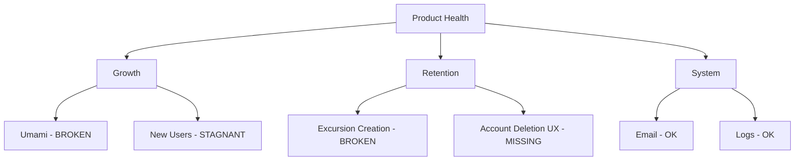

# Hundkrets Weekly Review — 2026-06-29

## Metrics Snapshot
| Metric | Value | Δ (7d) |
|--------|-------|--------|
| Total Users | 111 | |
| New Users | 0 | |
| Connection Requests | 49 | -2 |
| New Connections (7d) | N/A | |
| Excursions Created | 1 | -2 |
| New Excursions (7d) | N/A | |
| Page Views (7d) | 0 | |
| Unique Visitors (7d) | 0 | |
| Emails w/ Errors | 0 | |

Top Pages (7d):
(No data available)

## Website Audit Findings
- **Landing Page**: CTA and map are visible.
- **Registration/Onboarding**: Flow is functional; registration succeeds and redirects to `/onboarding/choice`. Profile form includes name, postal code, and map.
- **Explore**: Logged-in explore page renders with map.
- **Excursions**: Public excursion view is available, but the "Create Excursion" button is missing/not found in the audit flow (`hasCreateBtn: false`).
- **Account Deletion**: Browser-based delete button not found in `/app/profile` or `/app/settings`; system relied on PB SDK fallback.

## System Health
- **Analytics**: 🔴 **Critical Issue**: All Umami metrics are zero. The tracking script is likely not installed or not firing on `hundkrets.se`.
- **Emails**: Email delivery appears healthy with no errors in the recent log.
- **Logs**: Admin logs show standard activity (auth-refresh, realtime subscriptions) with no immediate 500 errors.

## Priorities

### 🔴 Critical — fix this week
- **Fix Analytics**: Investigate and install/fix Umami tracking script on `hundkrets.se` to restore visibility into user behavior.
- **Restore Excursion Creation**: Fix the "Create Excursion" button visibility/functionality in the app.

### 🟡 Important — within 2 weeks
- **Implement Account Deletion UI**: Add a visible "Delete Account" button in user settings to avoid reliance on backend SDKs.
- **Add `created` field to Collections**: Add timestamps to `connection_requests` and `excursions` to allow for weekly delta tracking.

### 🟢 Nice to have — backlog
- **Improve Onboarding Flow**: Review the transition from `/onboarding/choice` to the main app to ensure zero friction.

