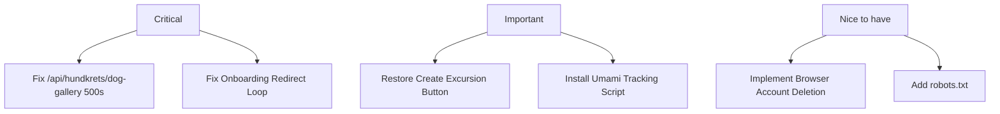

# Hundkrets Weekly Review — 2026-07-06

## Metrics Snapshot
| Metric | Value | Δ (7d) |
|--------|-------|--------|
| Total Users | 111 | |
| New Users | 0 | |
| Connection Requests | 49 | -2 |
| New Connections (7d) | N/A | |
| Excursions Created | 1 | -2 |
| New Excursions (7d) | N/A | |
| Page Views (7d) | 0 | |
| Unique Visitors (7d) | 0 | |
| Emails w/ Errors | 0 | |

Top Pages (7d):
(No data available - Umami metrics are zero)

## Website Audit Findings
- **Onboarding Flow**: Registration and profile filling are functional. However, the "Explore" and "Public Excursions" pages are redirecting users back to `/onboarding/choice` (seen in `explore` and `excursionsPublic` URLs in the report), suggesting a flow block where users cannot escape the onboarding sequence even after filling a profile.
- **Excursion Creation**: `hasCreateBtn: false` indicates the "Create Excursion" button is missing or unreachable for the test user, blocking the core value proposition.
- **Account Deletion**: `deleteBtnFound: false`. The browser-based account deletion button is missing from `/app/profile` and `/app/settings`, forcing a fallback to the PB SDK.

## System Health
- **API Errors**: Admin logs show multiple `HTTP 500` errors for the `/api/hundkrets/dog-gallery` endpoint, indicating a server-side crash when attempting to load the dog gallery.
- **Analytics**: Umami metrics are all zero. The tracking script is likely missing or misconfigured on `hundkrets.se`.
- **Robot.txt**: Multiple `HTTP 404` errors for `/robots.txt`, which is a minor SEO issue but indicative of missing static assets.

## Priorities

### 🔴 Critical — fix this week
- **Fix `/api/hundkrets/dog-gallery` 500 errors**: Users cannot view the dog gallery, which is a primary visual feature.
- **Fix Onboarding Redirect Loop**: Users are stuck at `/onboarding/choice` and cannot access the Explore page.

### 🟡 Important — within 2 weeks
- **Restore "Create Excursion" button**: Users currently cannot initiate new meetups.
- **Fix Umami Analytics**: Re-install/configure the tracking script to regain visibility into user growth and behavior.

### 🟢 Nice to have — backlog
- **Implement UI-based Account Deletion**: Provide a visible delete button in settings to avoid relying on SDK fallbacks.
- **Add `robots.txt`**: Resolve 404s for search crawler health.
