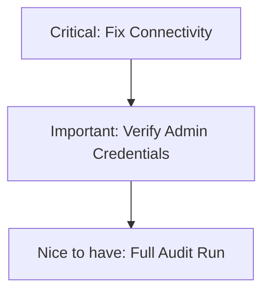

# Hundkrets Weekly Review — 2026-07-27

## Metrics Snapshot
| Metric | Value | Δ (7d) |
|--------|-------|--------|
| Total Users | N/A | |
| New Users | N/A | |
| Connection Requests | N/A | |
| New Connections (7d) | N/A | |
| Excursions Created | N/A | |
| New Excursions (7d) | N/A | |
| Page Views (7d) | 0 | |
| Unique Visitors (7d) | 0 | |
| Emails w/ Errors | N/A | |

Top Pages (7d):
None available due to connection errors.

## Website Audit Findings
The audit failed completely due to network connectivity issues.
- **Connectivity**: Multiple `net::ERR_INTERNET_DISCONNECTED` errors encountered when attempting to reach `hundkrets.se` and `umami.henrybergstrom.com`.
- **Visuals**: Screenshots were captured but the report indicates that the actual page content was not reachable during the audit script's execution.
- **Flows**:
    - Registration, Landing Page, and Onboarding steps failed.
    - Explore page redirected to `/login` and reported `hasMap: false`.
    - Excursion creation and public view buttons were not found.

## System Health
- **Critical Failure**: The audit runner could not connect to the internet or the target servers.
- **Umami**: All metrics are zero. This is likely a result of the `ERR_INTERNET_DISCONNECTED` error rather than a missing tracking script.
- **Admin**: PocketBase admin check was skipped due to authentication failure or missing credentials.

## Priorities

### 🔴 Critical — fix this week
- **Restore Connectivity**: Investigate why the audit environment is experiencing `net::ERR_INTERNET_DISCONNECTED`. Ensure the runner has DNS and network access to `hundkrets.se` and `umami.henrybergstrom.com`.

### 🟡 Important — within 2 weeks
- **Fix Admin Credentials**: Resolve the "credentials not set or auth failed" issue for the PocketBase admin check to restore system health visibility.

### 🟢 Nice to have — backlog
- **Rerun Full Audit**: Once connectivity is restored, perform a clean run to get actual quantitative metrics and qualitative screenshot analysis.
