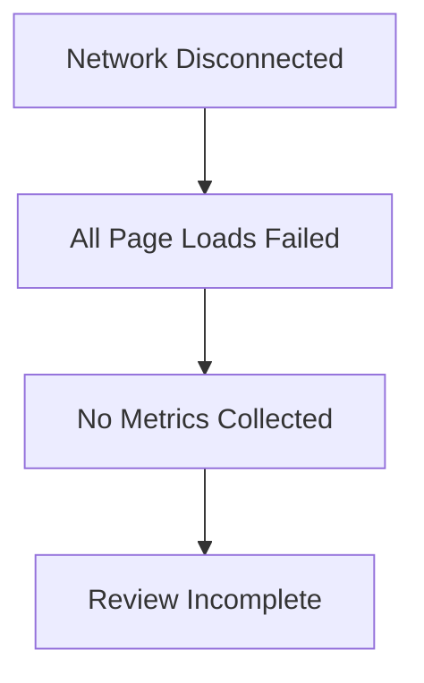

# Hundkrets Weekly Review — 2026-08-03

## Metrics Snapshot
| Metric | Value | Δ (7d) |
|--------|-------|--------|
| Total Users | - | |
| New Users | - | |
| Connection Requests | - | |
| New Connections (7d) | N/A | |
| Excursions Created | - | |
| New Excursions (7d) | N/A | |
| Page Views (7d) | - | |
| Unique Visitors (7d) | - | |
| Emails w/ Errors | - | |

**Top Pages (7d):**
- No data available due to network errors.

## Website Audit Findings
The audit failed catastrophically due to network connectivity issues (`net::ERR_INTERNET_DISCONNECTED`). 
- **Landing Page**: Failed to load.
- **Registration**: Failed to load.
- **Explore/Excursions**: Failed to load.
- **Umami/Admin**: Failed to fetch.

Only onboarding screenshots were captured/available, but the JSON report indicates the browser could not reach `hundkrets.se`.

## System Health
- **Connectivity**: Critical failure. The review environment was unable to connect to the internet or the target domains.
- **Auth**: Admin credentials were not set or authentication failed.

## Priorities

### 🔴 Critical — fix this week
- **Restore Network Connectivity**: Investigate why the review environment is disconnected from the internet.
- **Fix Authentication**: Configure admin credentials for the review script.

### 🟡 Important — within 2 weeks
- **Re-run Audit**: Once connectivity is restored, run a full review to get actual product metrics.

### 🟢 Nice to have — backlog
- N/A (Unable to assess product state).

